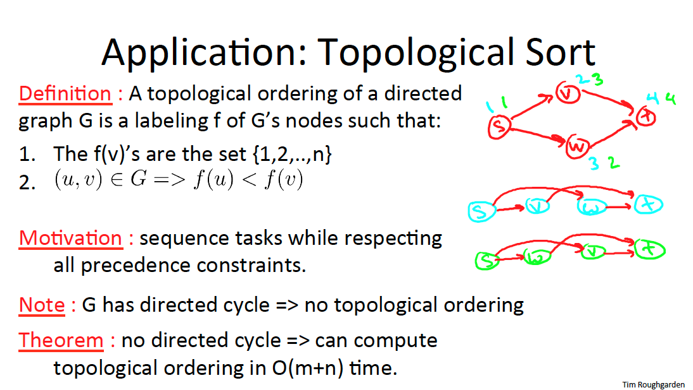

# Depth First Search ( DFS - Recursive )
[https://en.wikipedia.org/wiki/Depth-first_search](https://en.wikipedia.org/wiki/Depth-first_search)

## Contents
* [Lecture Slides](#lecture-slides)
* [Solution](#solution)
* [Build Instructions](#build-instructions)
* [Dependencies](#dependencies)

## Lecture Slides

---

---

---

---

---

---

---

---

## Solution
```cpp

    /**
     *
     * Modern C++ implementation of Depth First Search algorithm on a graph
     *
     * (c) Copyright 2019 Clayton J. Wong ( http://www.claytonjwong.com )
     *
     **/
    
    
    #include <iostream>
    #include <vector>
    #include <unordered_set>
    #include <unordered_map>
    #include <queue>
    
    
    using namespace std;
    
    
    class Solution
    {
    public:
    
        using Vertex = unsigned char;
        using AdjacencyList = vector< Vertex >;
        using Graph = unordered_map< Vertex, AdjacencyList >;
        using Seen = unordered_set< Vertex >;
    
        Seen dfs( Graph& G, Vertex start='s' )
        {
            Seen seen{ start };
            go( G, start, seen );
            return seen;
        }
    
        void go( Graph& G, Vertex cur, Seen& seen ) // (cur)rent vertex at the top of the callstack
        {
            for( auto adj: G[ cur ] )               // (adj)acent neighbor vertices of the (G)raph's (cur)rent vertex
                if( seen.insert( adj ).second )     // if this is the first time the (adj)acent neighbor vertex has been seen
                    go( G, adj, seen );             // go further process (adj)acent neighbor vertex
        }
    
    };
    
    int main()
    {
        //
        // Figure 8.5 from page 26 of Algorithms Illuminated ( Part 2 )
        //
        Solution::Graph G = {
    
            { 's', { 'a', 'b' } },
    
            { 'a', { 's', 'c' } },
    
            { 'b', { 's', 'c' } },
    
            { 'c', { 'a', 'b', 'd', 'e' } },
    
            { 'd', { 'b', 'c', 'e' } },
    
            { 'e', { 'c', 'd', } }
    
        };
        Solution s;
        auto result = s.dfs( G );
    
        return 0;
    }

```

## Build Instructions
Use ```cmake``` to build this project:

```
    cmake --build cmake-build-debug --target dfs_rec -- -j 4
```

## Dependencies
* [cmake.org](https://cmake.org)
