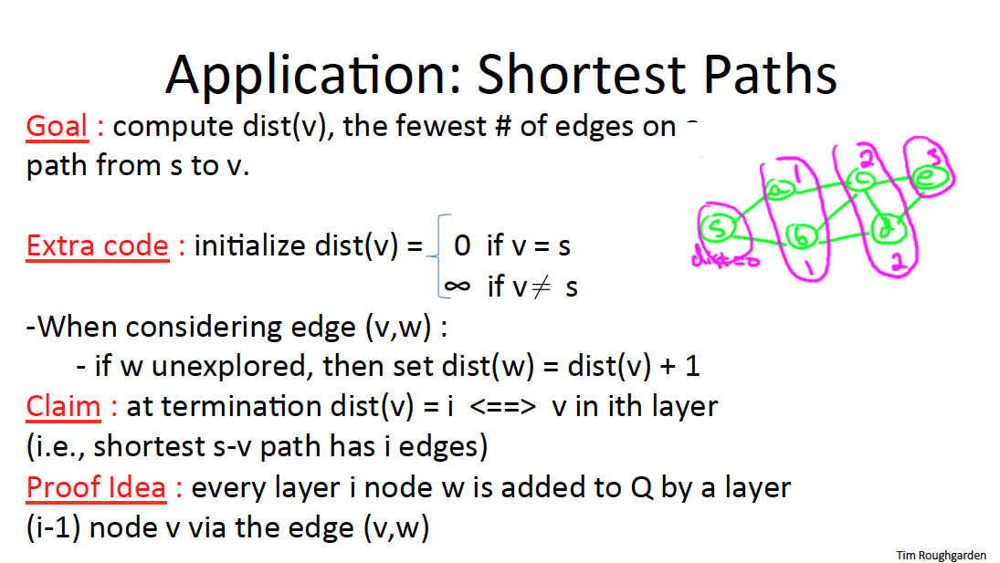

# Topological Sort ( BFS - Iterative Pruning )
[https://en.wikipedia.org/wiki/Breadth-first_search](https://en.wikipedia.org/wiki/Breadth-first_search)

## Contents
* [Lecture](#lecture)
* [Lecture Slides](#lecture-slides)
* [Solution](#solution)
* [Build Instructions](#build-instructions)
* [Dependencies](#dependencies)

# Lecture
* [Video](https://www.coursera.org/lecture/algorithms-graphs-data-structures/topological-sort-yeKm7)

## Lecture Slides

---

---

---

---

---

---

---

## Solution
```cpp

    /**
     *
     * Modern C++ implementation of Topological Sort algorithm
     *
     * (c) Copyright 2019 Clayton J. Wong ( http://www.claytonjwong.com )
     *
     **/
     
    
    #include <iostream>
    #include <unordered_map>
    #include <unordered_set>
    #include <set>
    #include <vector>
    #include <queue>
    
    
    using namespace std;
    
    
    class Solution
    {
    public:
    
        using Vertex = unsigned char;
        using AdjacencyList = unordered_set< Vertex >;
        struct AdjacentRelations{ AdjacencyList parent, children; };
        using Graph = unordered_map< Vertex, AdjacentRelations >;
        using Seen = unordered_set< Vertex >;
        using OrderedList = vector< Vertex >;
        using Queue = queue< Vertex >;
    
        OrderedList topo_sort( Graph G, OrderedList L={}, Queue q={}, Seen seen={} )
        {
            for( auto& pair: G ) // initialize (q)ueue to contains all vertices without parents
            {
                auto vertex{ pair.first };
                auto parent{ pair.second.parent };
                if( parent.empty() && seen.insert( vertex ).second )
                    q.push( vertex );
            }
            for( Vertex cur; ! q.empty(); q.pop() ) // pruning (q)ueue contains seen vertices without parents
            {
                cur = q.front(), L.push_back( cur );
                for( auto child: G[ cur ].children )
                {
                    G[ child ].parent.erase( cur );
                    if( G[ child ].parent.empty() && seen.insert( child ).second )
                        q.push( child );
                }
            }
            for( auto& pair: G ) // append remaining vertices onto the end of the list in arbitrary order since these vertices form a cycle
            {
                auto vertex{ pair.first };
                if( seen.insert( vertex ).second )
                    L.push_back( vertex );
            }
            return L;
        }
    
    };
    
    int main()
    {
        //
        // graph from Quiz 8.3 on page 45 of Algorithms Illuminated: Part 2
        //
        Solution::Graph G{
            { '1', { { '3' }, { '2' } } },
            { '2', { { '1' }, { '3' } } },
            { '3', { { '2', '4' }, { '4' } } },
            { '4', { { '3' }, { '3', '5', '6' } } },
            { '5', { {     }, { '4' } } },
            { '6', { { '4', '8' }, { '4', '7' } } },
            { '7', { { '6' }, { '8' } } },
            { '8', { { '7' }, { '6' } } },
        };
        Solution s;
        auto list = s.topo_sort( G );
        copy( list.cbegin(), list.cend(), ostream_iterator< Solution::Vertex >( cout, " " ) );
    
        return 0;
    }

```

## Build Instructions
Use ```cmake``` to build this project:

```
    cmake --build cmake-build-debug --target topo_sort_prune_bfs -- -j 4
```

## Dependencies
* [cmake.org](https://cmake.org)
