# Job Scheduling
[https://en.wikipedia.org/wiki/Scheduling_(computing)](https://en.wikipedia.org/wiki/Scheduling_(computing))

## Contents
* [Lecture](#lecture)
* [Lecture Slides](#lecture-slides)
* [Solution](#solution)
* [Build Instructions](#build-instructions)
* [Dependencies](#dependencies)

# Lecture
* [Video](https://www.coursera.org/lecture/algorithms-greedy/a-greedy-algorithm-Jo6gK)

## Lecture Slides

---
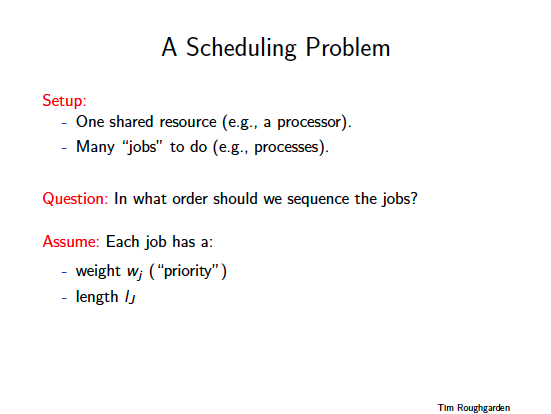
---
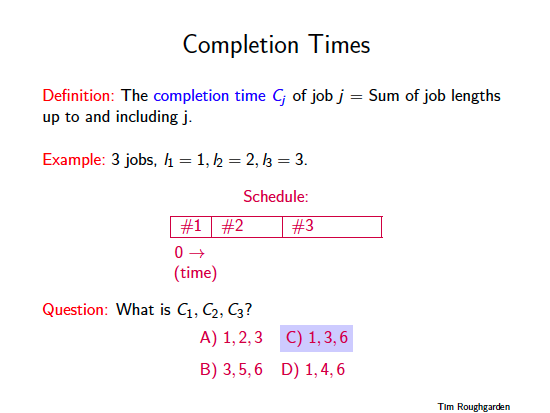
---
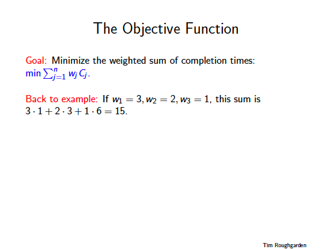
---

---
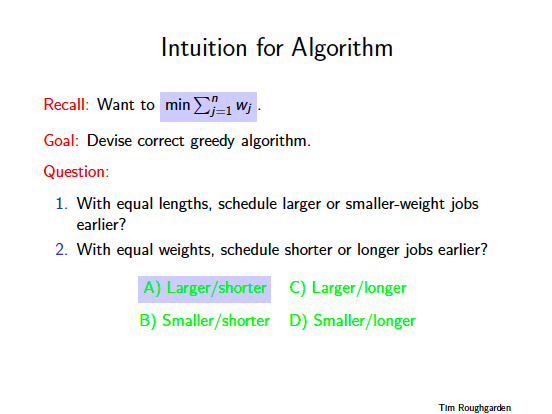
---
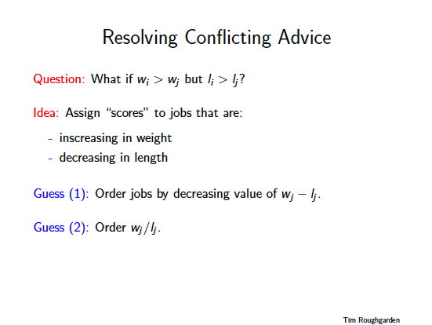
---
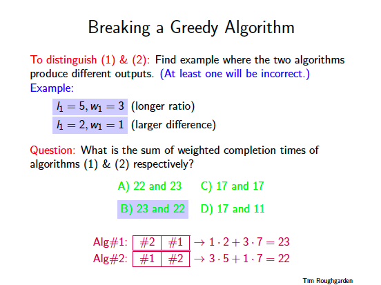
---
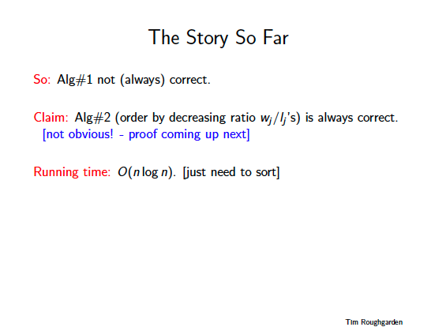
---

---
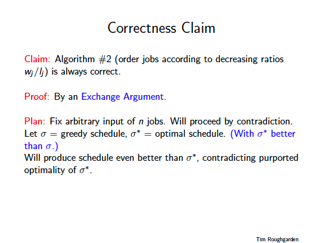
---
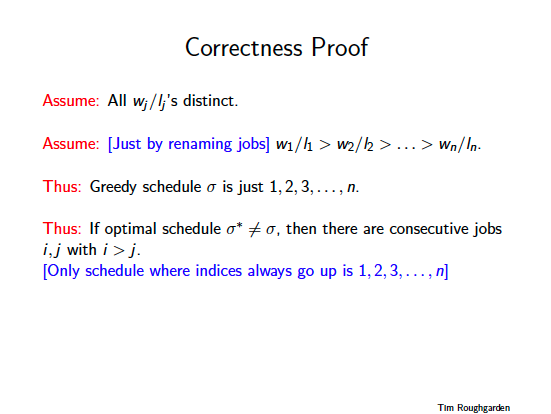
---
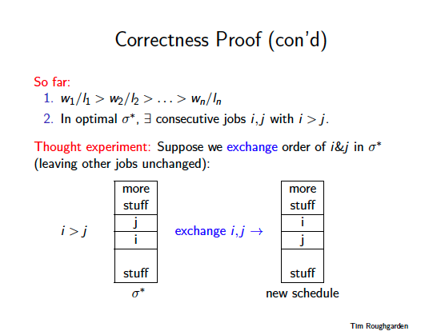
---

---
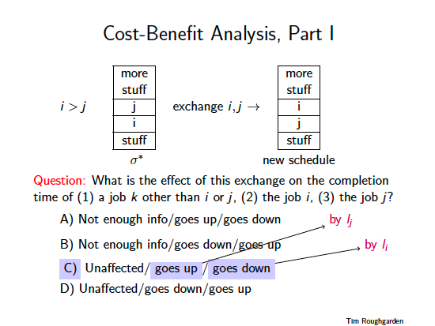
---
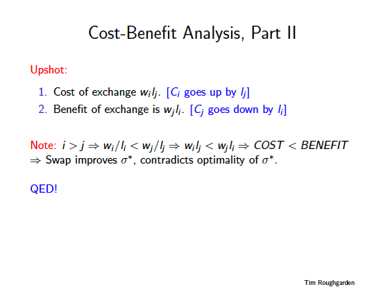
---

---
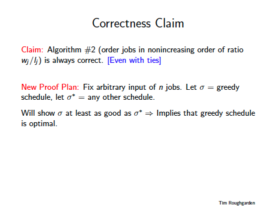
---
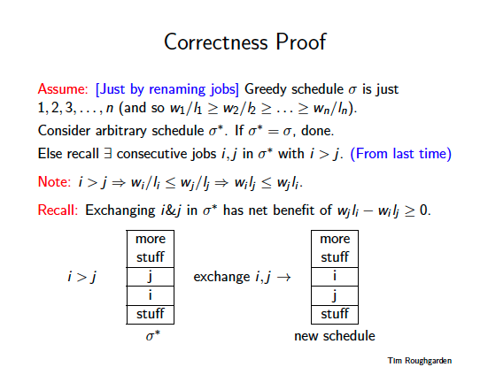
---
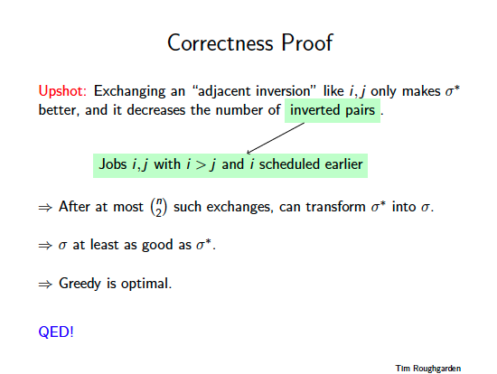
---

## Solution
```cpp

    /**
     *
     * Modern C++ implementation of a greedy job scheduling algorithm
     *
     * (c) Copyright 2019 Clayton J. Wong ( http://www.claytonjwong.com )
     *
     **/
    
    
    #include "input.hpp"
    #include <iostream>
    #include <sstream>
    #include <set>
    
    
    using namespace std;
    using Type = long long;
    

    template< typename Job >
    class Solution
    {
    public:
    
        void print(){ copy( jobs.begin(), jobs.end(), ostream_iterator< Job >( cout, "\n" ) ); }
    
        void insert( Job&& job ){ jobs.insert( job ); }
    
        Type schedule() const
        {
            Type cost{ 0 }, time{ 0 };
            for( auto& job: jobs )
                time += job.time,
                cost += job.cost * time;
            return cost;
        }
    
    private:
    
        using Jobs = multiset< Job >;
    
        Jobs jobs;
    
    };
    
    
    struct Job
    {
        const Type cost{ 0 }, time{ 0 };
        Job( Type cost, Type time ) : cost{ cost }, time{ time } {}
        virtual bool operator<( const Job& ) const = 0;
    };
    ostream& operator<<( ostream& os, const Job& j ){ os << "{" << j.cost << "," << j.time << "}"; return os; }
    
    struct D_Job : public Job // a D_Job is sub-optimal greedily scheduled via the (D)ifference ( cost - time )
    {
        D_Job( Type cost, Type time ) : Job{ cost, time } {}
        bool operator<( const Job& rhs ) const
        {
            return ( cost - time ) >  ( rhs.cost - rhs.time )
               || (( cost - time ) == ( rhs.cost - rhs.time ) && cost > rhs.cost );
        }
    };
    
    struct R_Job : public Job // a R_Job is optimal greedily scheduled via the (R)atio ( cost / time ) ( i.e. cost divided by time )
    {
        R_Job( Type cost, Type time ) : Job{ cost, time } {}
        bool operator<( const Job& rhs ) const
        {
            return ( cost / double( time )) > ( rhs.cost / double( rhs.time ));
        }
    };
    
    
    template< typename Job >
    Type schedule( const string& input )
    {
        Solution< Job > jobs;
        istringstream stream{ input };
        for( string line; getline( stream, line ); )
        {
            stringstream parser{ line };
            Type cost{ 0 }, time{ 0 };
            parser >> cost >> time;
            jobs.insert({ cost, time });
        }
        return jobs.schedule();
    }
    
    
    int main()
    {
        cout << "lecture answer 1: "    << schedule< D_Job >( Lecture::Input )    << " ( sub-optimal )" << endl
             << "lecture answer 2: "    << schedule< R_Job >( Lecture::Input )    << " ( optimal )" << endl << endl
             << "assignment answer 1: " << schedule< D_Job >( Assignment::Input ) << " ( sub-optimal )" << endl
             << "assignment answer 2: " << schedule< R_Job >( Assignment::Input ) << " ( optimal )" << endl;
    
        return 0;
    }
    
```

## Build Instructions
Use ```cmake``` to build this project:

```
    cmake --build cmake-build-debug --target schedule_jobs -- -j 4
```

## Dependencies
* [cmake.org](https://cmake.org)
