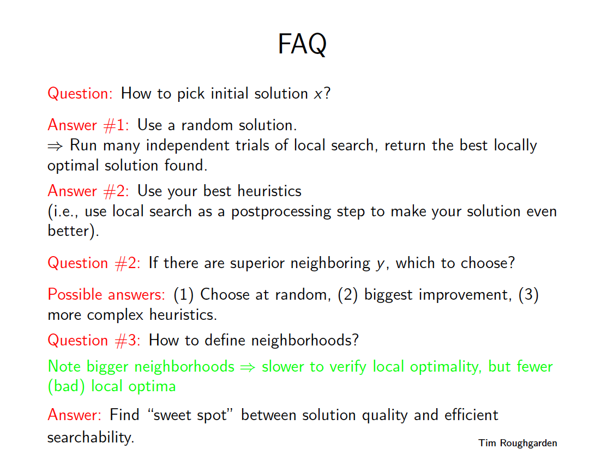
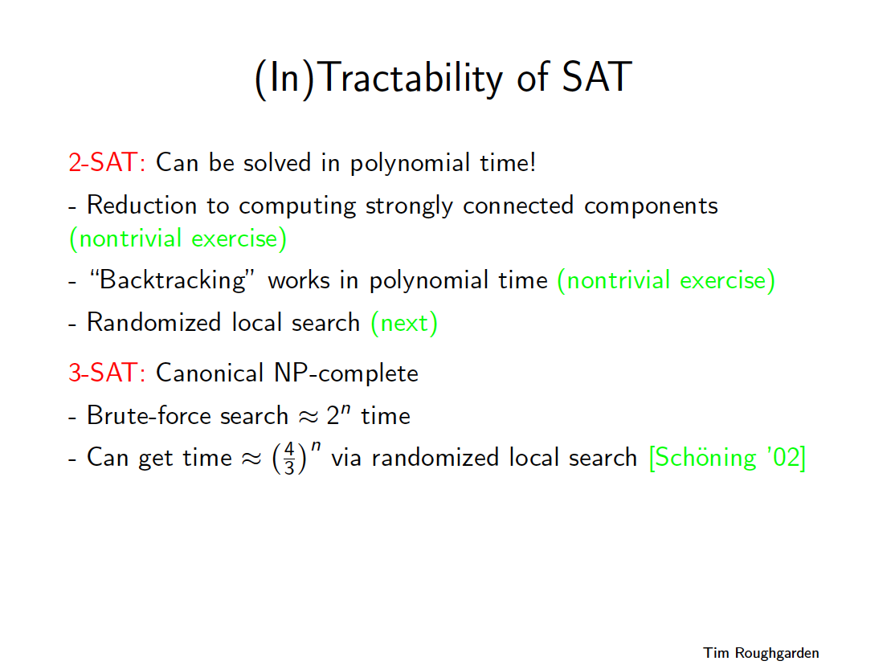
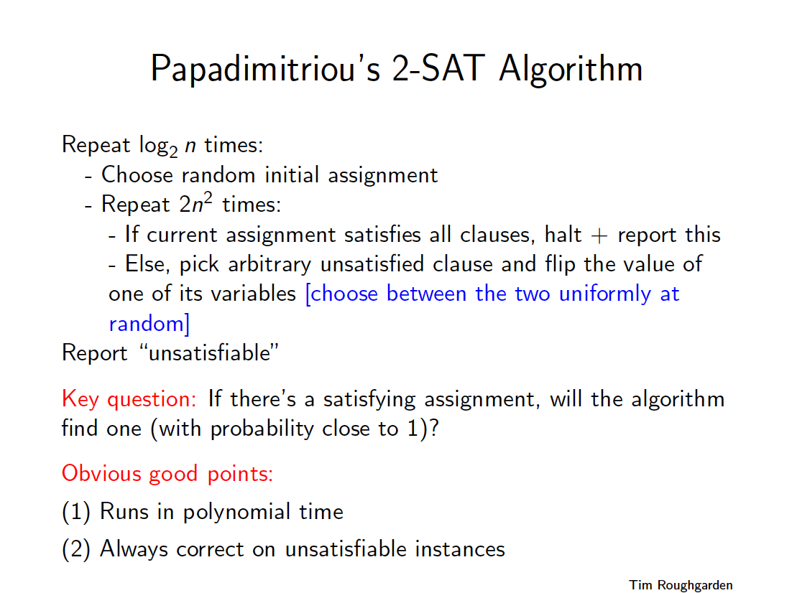
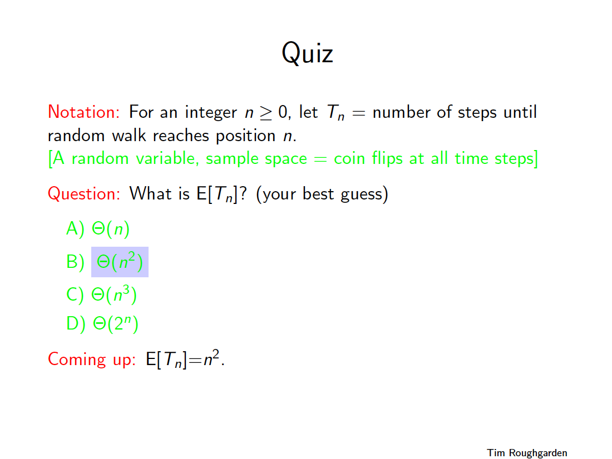
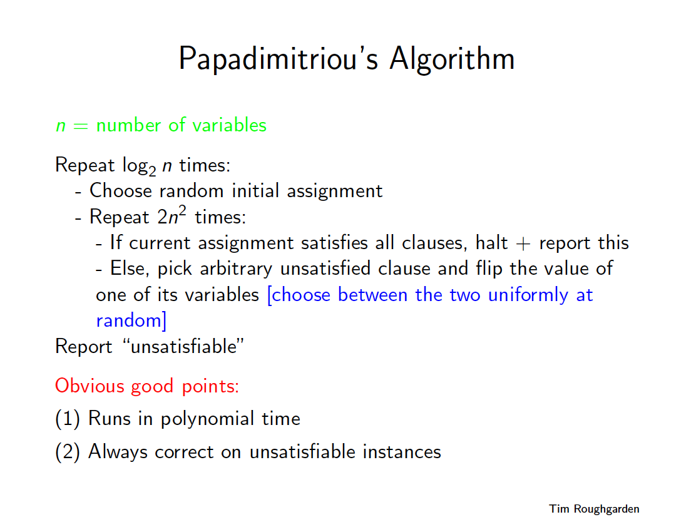
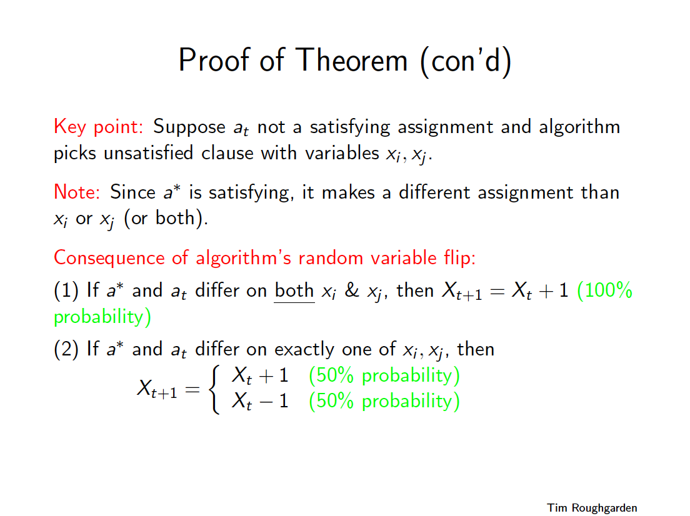
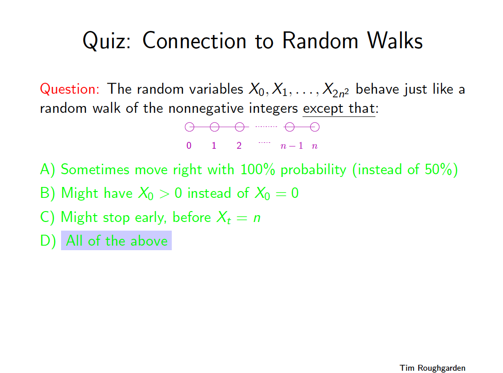

# 2-SAT ( constraint satisfaction )
* [https://en.wikipedia.org/wiki/2-satisfiability](https://en.wikipedia.org/wiki/2-satisfiability)

## Contents
* [Lecture](#lecture)
* [Lecture Slides](#lecture-slides)
* [Solution](#solution)
* [Build Instructions](#build-instructions)
* [Dependencies](#dependencies)

## Lecture
[Video](https://www.coursera.org/lecture/algorithms-npcomplete/the-2-sat-problem-ERxmM)

## Lecture Slides

---

---

---

---

---

---

---

---

---

---

---

---

---

---

---

---

---

---

---

---

---

## Solution
```cpp

    /**
     *
     * Modern C++ implementation of 2-constraint satisfaction problem solved in polynomial asymptotic runtime
     * via randomized Papadimitriou local search algorithm
     *
     * (c) Copyright 2019 Clayton J. Wong ( http://www.claytonjwong.com )
     *
     **/
    
    
    #include <iostream>
    #include <sstream>
    #include <fstream>
    #include <vector>
    #include <random>
    #include <unordered_map>
    #include <unordered_set>
    #include <algorithm>
    
    
    using namespace std;
    using Type = int;
    constexpr auto INF = numeric_limits< Type >::max();
    struct Literal
    {
        Type value{ 0 };
        bool assignment{ true }, constraint{ true };
    };
    struct Clause
    {
        Literal first, second;
        bool isSatisfied(){ return( first.assignment == first.constraint ) || ( second.assignment == second.constraint ); }
    };
    using ClauseList = vector< Clause >;
    
    
    namespace Papadimitriou
    {
        class Solution
        {
        public:
    
            bool isSatisfiable( ClauseList& clauseList )
            {
                auto N{ clauseList.size() };
                auto logN{ 0 }; for( auto n{ N }; n > 1; n >>= 1, ++logN );
                while( logN-- > 0 )
                {
                    randomInitialAssignment( clauseList );
                    for( auto i{ 0 }; i < 2 * N * N; ++i )
                    {
                        bool ok{ true };
                        for( auto& clause: clauseList ) if( ! clause.isSatisfied() ) // random literal assignment flip upon arbitrarily first found unsatisfied clause
                        {
                            ok = false;
                            auto[ value, assignment ] = flipRandomAssignment( clause );
                            for( auto& clause: clauseList ) // propagate random literal assignment flip from above for all clauses
                            {
                                if( value == clause.first.value ) clause.first.assignment = assignment;
                                if( value == clause.second.value ) clause.second.assignment = assignment;
                            }
                            break;
                        }
                        if( ok ) return true;
                    }
                }
                return false;
            }
    
        private:
    
            using RandomDevice = random_device;
            using Generator = mt19937;
            using Distribution = uniform_int_distribution< int >;
    
            bool randomAssignment( RandomDevice randomDevice=RandomDevice() )
            {
                Generator randomGenerator{ randomDevice() };
                Distribution distribution{ 0, 1 };
                return distribution( randomGenerator );
            }
    
            void randomInitialAssignment( ClauseList& clauseList )
            {
                for( auto& clause: clauseList )
                    clause.first.assignment = randomAssignment(),
                    clause.second.assignment = randomAssignment();
            }
    
            pair< Type, bool > flipRandomAssignment( Clause& clause, RandomDevice randomDevice=RandomDevice() )
            {
                Generator randomGenerator{ randomDevice() };
                Distribution distribution{ 0, 1 };
                auto first = distribution( randomGenerator ); // randomly flip the value of the first xor second literal assignment
                if( first )
                {
                    clause.first.assignment ^= 1;
                    return{ clause.first.value, clause.first.assignment };
                }
                else
                {
                    clause.second.assignment ^= 1;
                    return{ clause.second.value, clause.second.assignment };
                }
            }
    
        }; // class Solution
    
    } // namespace Papadimitriou
    
    
    ClauseList readInput( const string& filename, ClauseList clauseList={} )
    {
        fstream stream{ filename };
        auto N{ 0 };
        for( string line; getline( stream, line ); )
        {
            istringstream parser{ line };
            if( N > 0 ) // insert value/contraints into clauseList: negative values are changed to positive values ( "NOT" is expressed via false constraint )
            {
                Clause clause{ {0,true}, {0,true} };
                parser >> clause.first.value >> clause.second.value;
                if( clause.first.value < 0 )
                    clause.first.value *= -1,
                    clause.first.constraint = false;
                if( clause.second.value < 0 )
                    clause.second.value *= -1,
                    clause.second.constraint = false;
                clauseList.push_back( clause );
            }
            else
            {
                parser >> N;
            }
        }
        return clauseList;
    }
    
    
    int main()
    {
        Papadimitriou::Solution solution;
        string ans;
        for( auto& filename: { "2sat1.txt", "2sat2.txt", "2sat3.txt", "2sat4.txt", "2sat5.txt", "2sat6.txt" } )
        {
            auto clauseList = readInput( filename );
            auto ok = solution.isSatisfiable( clauseList );
            ans.push_back( ok? '1': '0' );
            cout << ( ok? '1': '0' ) << endl;
            flush( cout );
        }
    
        return 0;
    }

```

## Build Instructions
Use ```cmake``` to build this project:

```
    cmake --build cmake-build-debug --target 2sat -- -j 4
```

## Dependencies
* [cmake.org](https://cmake.org)
