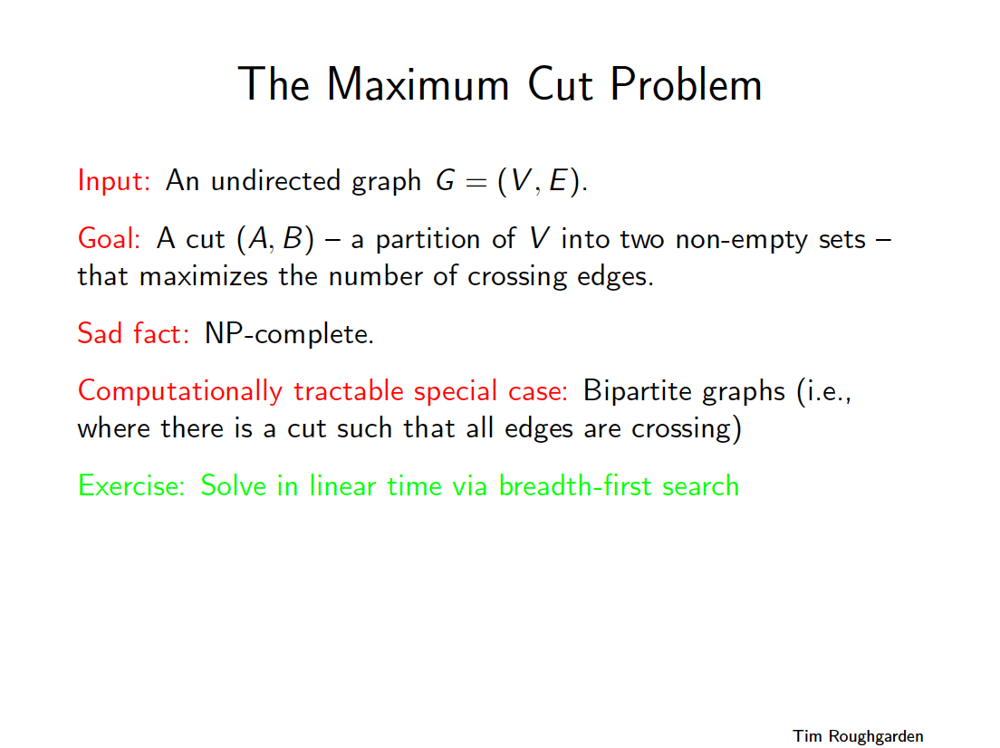
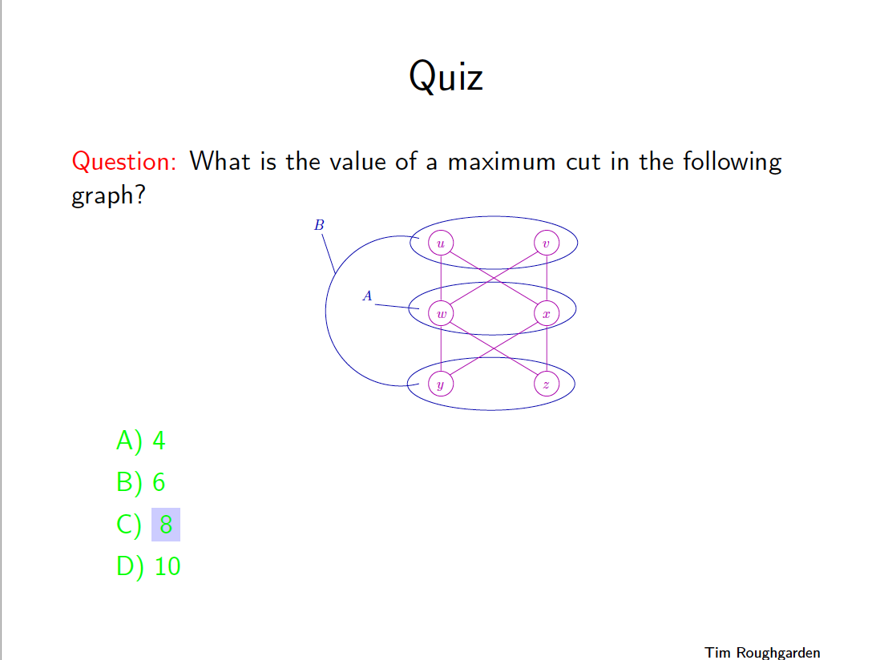
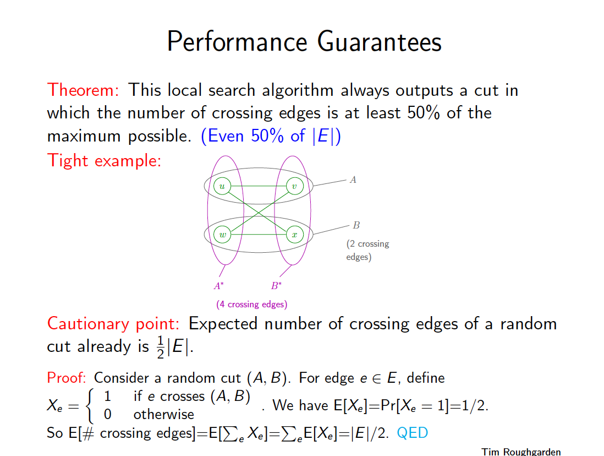
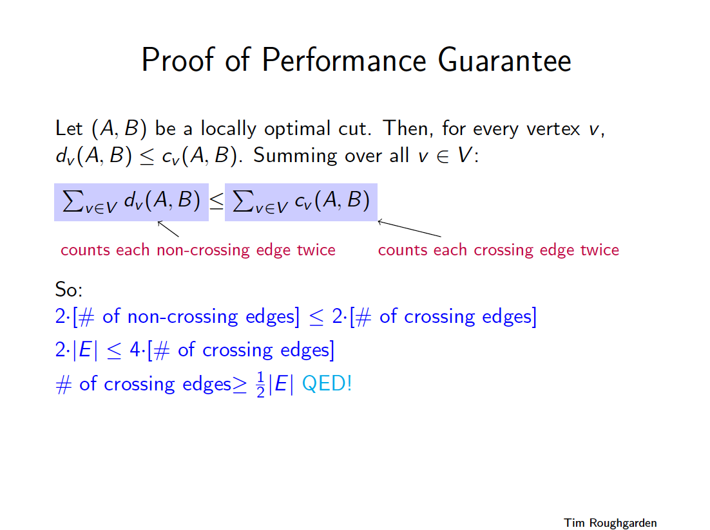

# Max Cut ( bipartite graph )
* [Wikipedia: Cut ( graph theory )]( https://en.wikipedia.org/wiki/Cut_(graph_theory) )
* [Wikipedia: Bipartite graph ]( https://en.wikipedia.org/wiki/Bipartite_graph )

## Contents
* [Lecture](#lecture)
* [Lecture Slides](#lecture-slides)
* [Solution](#solution)
* [Build Instructions](#build-instructions)
* [Dependencies](#dependencies)

## Lecture
[Video](https://www.coursera.org/lecture/algorithms-npcomplete/the-maximum-cut-problem-i-YpJsR)

## Lecture Slides

---

---

---

---

---

---

---

## Solution
```cpp

    /**
     *
     * Modern C++ implementation of Breadth First Search algorithm on a graph to determine if a graph is bipartite
     *
     * Note: a bipartite graph is a graph whose vertices can be divided into two disjoint and independent sets A, B
     * such that every edge connects a vertex in A to a vertex in B
     *
     * (c) Copyright 2019 Clayton J. Wong ( http://www.claytonjwong.com )
     *
     **/
    
    
    #include <iostream>
    #include <iomanip>
    #include <vector>
    #include <unordered_set>
    #include <unordered_map>
    #include <queue>
    
    
    using namespace std;
    using Vertex = unsigned char;
    using AdjacencyList = vector< Vertex >;
    using Graph = unordered_map< Vertex, AdjacencyList >;
    using Seen = unordered_set< Vertex >;
    using Queue = queue< Vertex >;
    enum class Color{ Black, White };
    using VertexColor = unordered_map< Vertex, Color >;
    
    
    class Solution
    {
    public:
    
        bool isBipartite( Graph& G, Vertex start, VertexColor color={} )
        {
            Seen seen{ start };
            for( Queue q{{ start }}; ! q.empty(); q.pop() )
            {
                auto cur = q.front();
                auto curColor = color[ cur ];
                auto adjColor = ( curColor == Color::Black )? Color::White : Color::Black; // (adj)acent vertex color expected to be opposite of (cur)rent vertex color
                for( auto adj: G[ cur ] )
                {
                    if( seen.find( adj ) != seen.end() ) // (adj)acent vertex seen already
                    {
                        if( color[ adj ] != adjColor )   // seen color not expected (adj)acent color
                            return false;
                        continue;
                    }
                    seen.insert( adj );
                    color[ adj ] = adjColor;
                    q.push( adj );
                }
            }
            return true;
        }
    
    }; // class Solution
    
    
    Graph createGraph( bool bipartite=true )
    {
        if( bipartite ) // lecture graph is bipartite: https://www.coursera.org/lecture/algorithms-npcomplete/the-maximum-cut-problem-i-YpJsR
            return
            {
                { 'u', { 'x', 'w' }},
                { 'v', { 'w', 'x' }},
                { 'w', { 'u', 'v' }},
                { 'x', { 'u', 'v' }},
                { 'y', { 'w', 'x' }},
                { 'z', { 'w', 'x' }},
            };
    
        return // wikipedia graph is NOT bipartite: https://en.wikipedia.org/wiki/Cut_(graph_theory)
        {
            { 'u', { 'v', 'w' }},
            { 'v', { 'u', 'w' }},
            { 'w', { 'u', 'v' }},
            { 'x', { 'v', 'y' }},
            { 'y', { 'x', 'w' }},
        };
    }
    
    
    int main()
    {
        for( auto G: { createGraph( true ), createGraph( false ) })
        {
            Solution solution;
            auto result = solution.isBipartite( G, 'u' ); // arbitrarily start at vertex 'u'
            cout << boolalpha << result << endl;
        }
    
        return 0;
    }

```

## Build Instructions
Use ```cmake``` to build this project:

```
    cmake --build cmake-build-debug --target bipartite_graph -- -j 4
```

## Dependencies
* [cmake.org](https://cmake.org)
