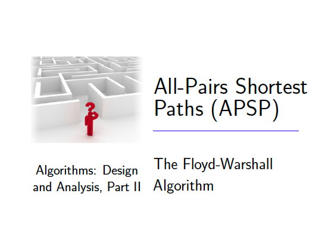
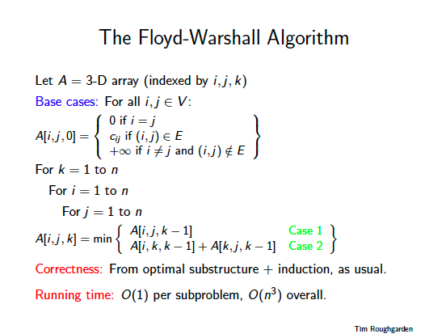

# Floyd Warshall ( memory optimized )
[https://en.wikipedia.org/wiki/Floyd%E2%80%93Warshall_algorithm](https://en.wikipedia.org/wiki/Floyd%E2%80%93Warshall_algorithm)

## Contents
* [Lecture](#lecture)
* [Lecture Slides](#lecture-slides)
* [Solution](#solution)
* [Build Instructions](#build-instructions)
* [Dependencies](#dependencies)

# Lecture
* [Video](https://www.coursera.org/lecture/algorithms-npcomplete/the-floyd-warshall-algorithm-WKb60)

## Lecture Slides

---

---

---

---

## Solution
```cpp

    /**
     *
     * Modern C++ implementation of Floyd Warshall's algorithm to find the all-pairs shortest paths in a graph
     *
     * (c) Copyright 2019 Clayton J. Wong ( http://www.claytonjwong.com )
     *
     **/
    
    
    #include <iostream>
    #include <fstream>
    #include <sstream>
    #include <vector>
    #include <string>
    #include <unordered_map>
    #include <unordered_set>
    
    
    using namespace std;
    using InputFiles = vector< string >;
    //
    // Assignment Input
    //
    const auto N{ 1000 };
    const InputFiles inputFiles{ "g1.txt", "g2.txt", "g3.txt" };
    //
    // Optional Challenge Input
    //
    //const auto N{ 20000 };
    //const InputFiles inputFiles{ "large.txt" };
    using Integer = long long;
    using Vertex = Integer;
    using Cost = Integer;
    using VI = vector< Cost >;
    using VVI = vector< VI >;
    using VVVI = vector< VVI >;
    static const Cost INF = numeric_limits< Cost >::max();
    struct Edge
    {
        Vertex u{ 0 }, v{ 0 };
        bool operator==( const Edge& rhs ) const { return u == rhs.u && v == rhs.v; }
    };
    struct Hash{ Cost operator()( const Edge& e ) const { return ( N+1 ) * e.u + e.v; } };
    using Edges = unordered_map< Edge, Cost, Hash >;
    using Answer = pair< VVI, bool >;
    
    
    Edges readInput( const string& filename, Edges edges={} )
    {
        fstream stream{ filename };
        for( string line; getline( stream, line ); )
        {
            stringstream parser{ line };
            Vertex i,j; Cost cost;
            parser >> i >> j >> cost;
            Edge edge{ i,j };
            edges.insert({ edge, cost }); // i -> j
        }
        return edges;
    }
    
    
    class Solution
    {
    public:
    
        Answer getShortestPaths( Edges& E )
        {
            VVI cur( N+1, VI( N+1, INF )), next( cur );
            for( auto i{ 1 }; i <= N; ++i ) for( auto j{ 1 }; j <= N; ++j ) // for each i,j: base cases for k == 1 ( k is non-inclusive, so Vertex 1 is NOT considered here )
            {
                Edge edge{ i,j };
                auto it = E.find( edge );
                auto cost = ( it != E.end() )? it->second : INF;
                cur[ i ][ j ] = ( i == j )? 0 : cost;
            }
            for( auto k{ 2 }; k <= N; ++k, swap( cur, next ) ) for( auto i{ 2 }; i <= N; ++i ) for( auto j{ 2 }; j <= N; ++j ) // for each i,j,k
            {
                // Note: let (1...k-1) denote a path which is only comprised of candidate vertices [1:k-1], that is 1 inclusive to k-1 inclusive
                //       this does NOT mean that all of these candidate vertices are included in this path, but these vertices are the only candidates
                //       which may potentially be included in the path ( this is a fundamental concept of this algorithm to create overlapping subproblems! )
                auto pre = cur[ i ][ j ], // (pre)vious cost of path i -> (1...k-1) -> j  ( without k )  [ note: pre/cur are NOT related here.  cur/next are a dp memory optimization ]
                     Cik = cur[ i ][ k ], // cost of path i -> (1...k-1) -> k
                     Ckj = cur[ k ][ j ], // cost of path k -> (1...k-1) -> j
                     alt = ( Cik < INF && Ckj < INF )? Cik + Ckj : INF; // (alt)ernative cost of path i -> (1...k-1) -> k -> (1...k-1) -> j
                next[ i ][ j ] = min( pre, alt );
            }
            return{ next, hasCycle( next ) };
        }
    
    
    
        Cost shortestPath( const VVI& A )
        {
            if( hasCycle( A ) )
                return INF;
            auto cost{ INF };
            for( auto i{ 1 }; i <= N; ++i )
                for( auto j{ 1 }; j <= N; ++j )
                    if( cost > A[ i ][ j ] )
                        cost = A[ i ][ j ];
            return cost;
        }
    
    private:
    
        bool hasCycle( const VVI& A )
        {
            for( auto i{ 1 }; i <= N; ++i )
                if( A[ i ][ i ] < 0 )
                    return true;
            return false;
        }
    
    }; // class Solution
    
    
    
    void test( const string& inputFile )
    {
        Solution solution;
        auto E = readInput( inputFile );
        auto[ A, hasCycle ] = solution.getShortestPaths( E );
        cout << inputFile << ": ";
        if( hasCycle )
            cout << "has a cycle" << endl;
        else
            cout << "has shortest path " << solution.shortestPath( A ) << endl;
    }
    
    
    int main()
    {
        for( auto& inputFile: inputFiles )
            test( inputFile );
    
        return 0;
    }

```

## Build Instructions
Use ```cmake``` to build this project:

```
    cmake --build cmake-build-debug --target floyd_warshall_memopt -- -j 4
```

## Dependencies
* [cmake.org](https://cmake.org)
