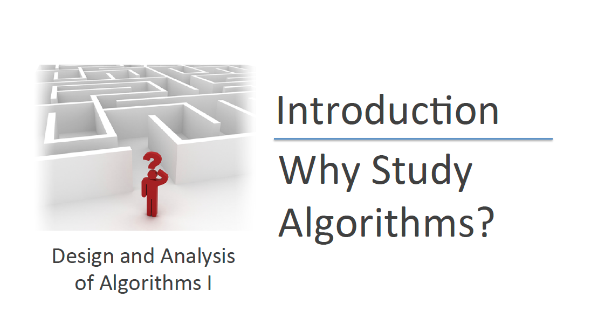
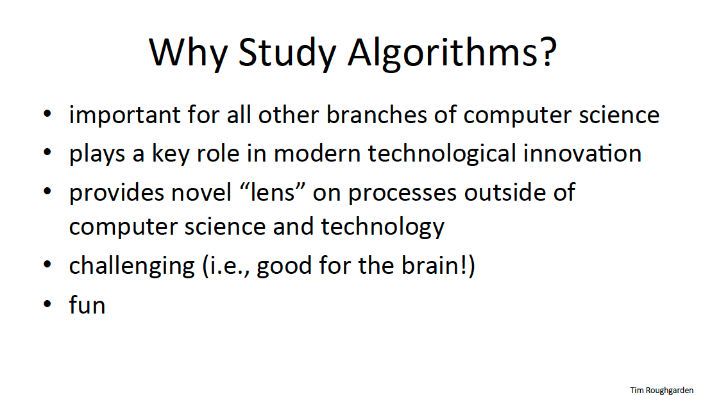
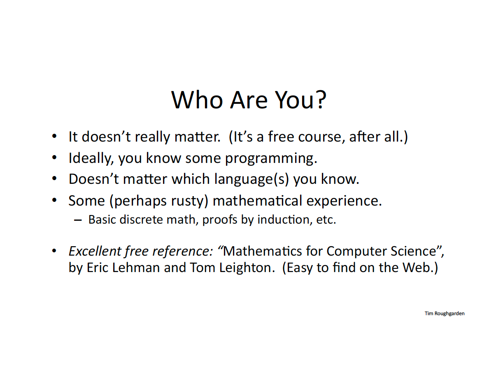
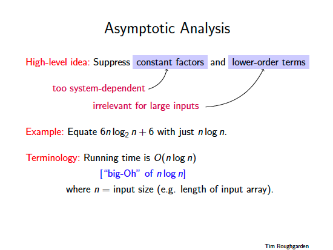
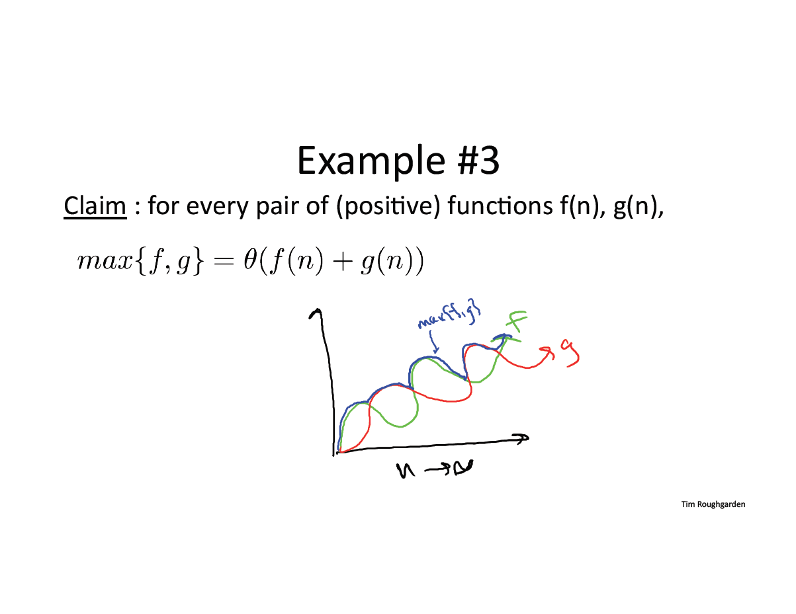

# Introduction, Guiding Principles, and Asymptotic Analysis

---

---

---

---

---

---

---

---

---

---

---

---

---

---

---

---

---

---

---

---

---

---

---

---

---

---

---

---

---

---

---

---

---

---

---
